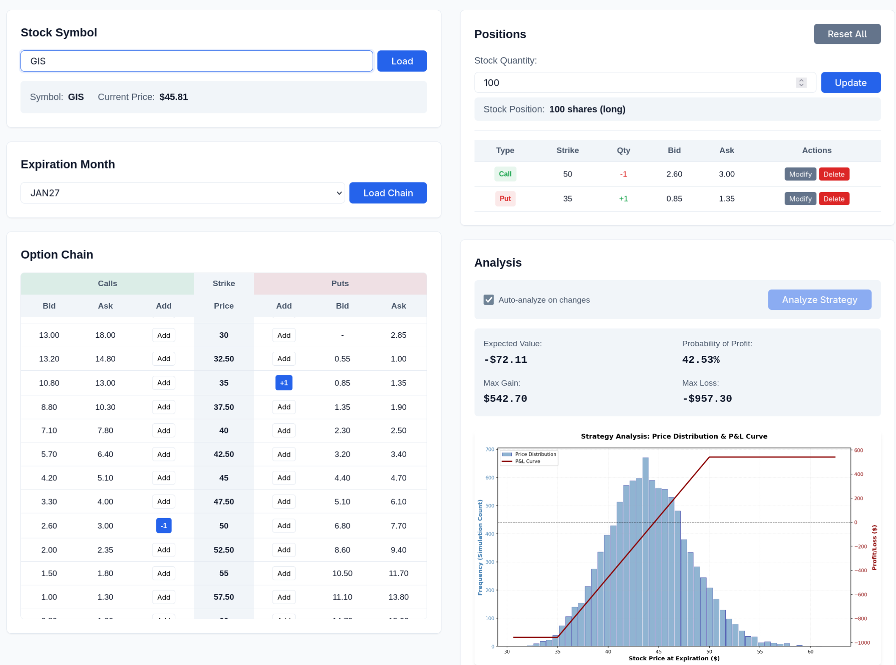

# Option Analyzer

A web-based platform for analyzing option trading strategies using historical price distributions and Monte Carlo simulation.



## Overview

FastAPI-based web application for analyzing option strategies using Monte Carlo simulation. Fetches live market data from IBKR, models price distributions using bootstrap sampling from historical returns, and visualizes P&L outcomes at expiration.

## Features

- **Real-time Market Data**: IBKR Client Portal API integration for live options chains and prices
- **Monte Carlo Simulation**: Bootstrap sampling from historical returns to model expiration outcomes
- **Interactive Web UI**: Build and analyze multi-leg option positions
- **Visualization**: P&L curves and probability distribution charts
- **Caching & Sessions**: Memory or Redis caching with persistent sessions
- **Rate Limiting**: API rate limit compliance

## Prerequisites

- Python 3.11+
- [IBKR Client Portal Gateway](https://www.interactivebrokers.com/en/index.php?f=5041) running on https://localhost:5000

## Installation

```bash
git clone https://github.com/kaveeken/option_analyzer
cd option_returns

# Using pip
python -m venv venv && source venv/bin/activate
pip install -e ".[dev]"

# Or using Poetry
poetry install && poetry shell
```

## Configuration

Create a `.env` file (see `.env.example`):

```bash
IBKR_BASE_URL=https://localhost:5000/v1/api
PORT=8080
DEFAULT_BOOTSTRAP=10000
DEFAULT_HISTORICAL_YEARS=5
CACHE_TYPE=memory  # or redis
```

## Usage

```bash
python -m option_analyzer
```

Navigate to `http://127.0.0.1:8080`, enter a symbol, select expiration, build your position, and run analysis.

API documentation: `/docs` (Swagger) or `/redoc`

## Development

### Running Tests

```bash
# Run all tests
pytest

# Run with coverage
pytest --cov=src/option_analyzer --cov-report=html

# Run specific test types
pytest -m "not integration"  # Skip integration tests
pytest -m "not e2e"          # Skip E2E tests

# Run tests in parallel
pytest -n auto
```

### Code Quality

```bash
# Format and lint
ruff check src/ tests/
ruff format src/ tests/

# Type checking
mypy src/
```

## Technical Details

Uses bootstrap Monte Carlo to model price distributions at expiration. Calculates geometric returns from historical data, samples with replacement, and generates price paths from present to expiration date. The simulation horizon matches the selected option expiration.

Implementation uses NumPy vectorization with memory or Redis caching for efficiency.

## Acknowledgments

Built with:
- [Claude Code](https://claude.com/claude-code) - AI-powered development assistant
- [FastAPI](https://fastapi.tiangolo.com/) - Modern web framework
- [NumPy](https://numpy.org/) - Numerical computing
- [Matplotlib](https://matplotlib.org/) - Visualization
- [Pydantic](https://docs.pydantic.dev/) - Data validation
- Interactive Brokers Client Portal API
